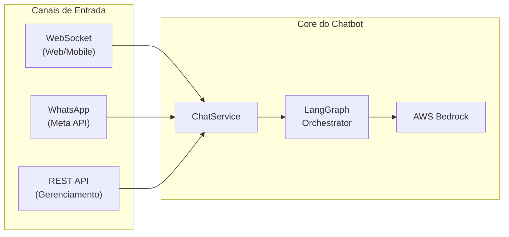
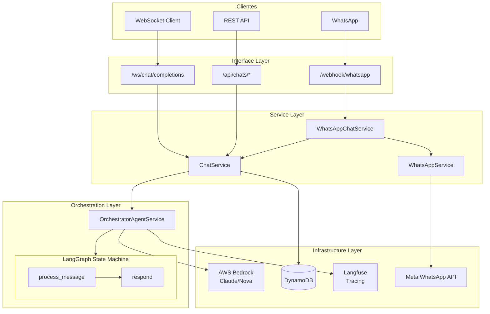
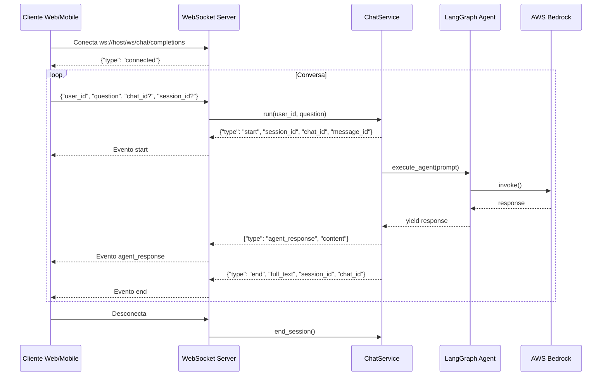
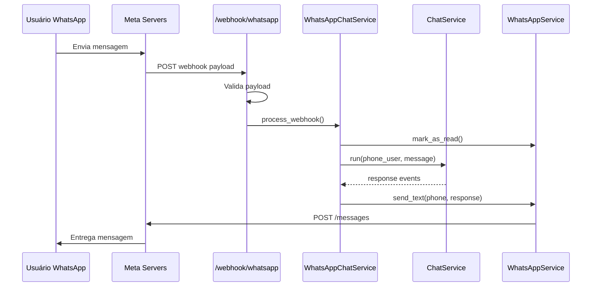
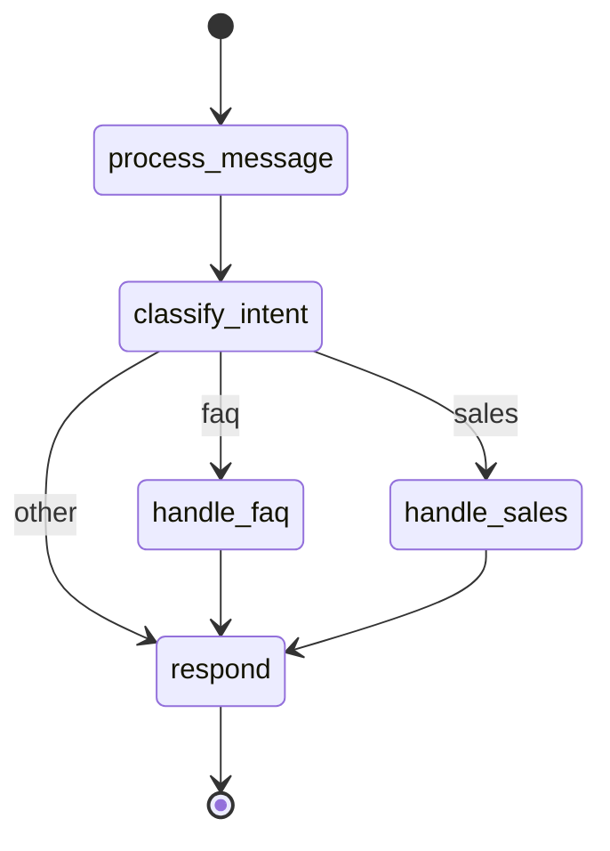
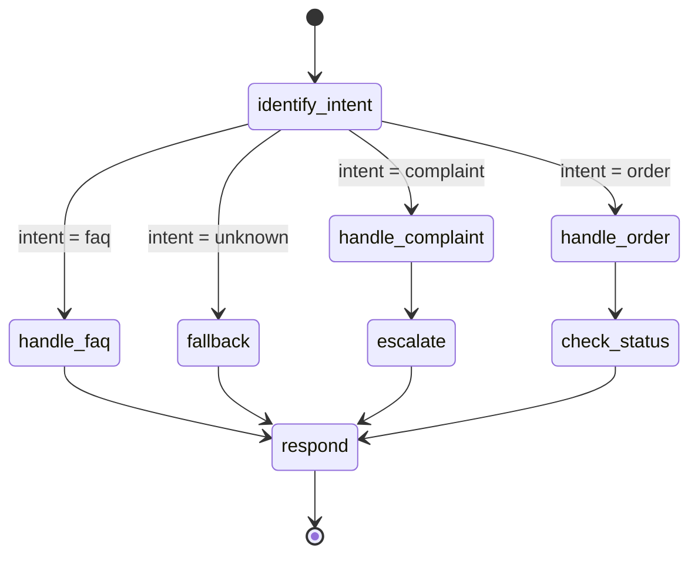
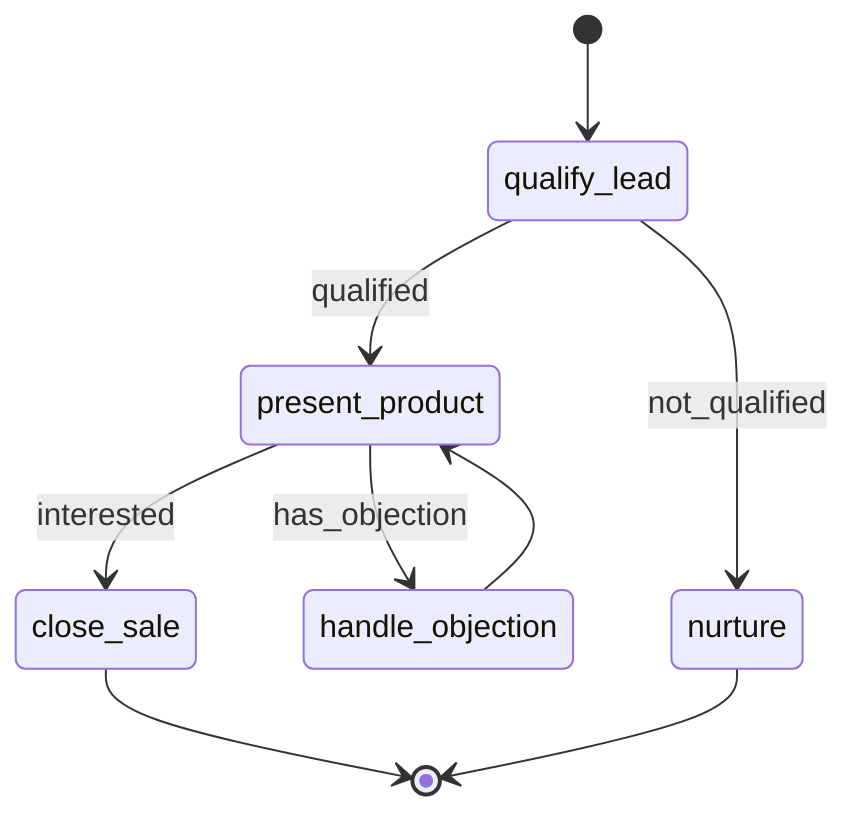
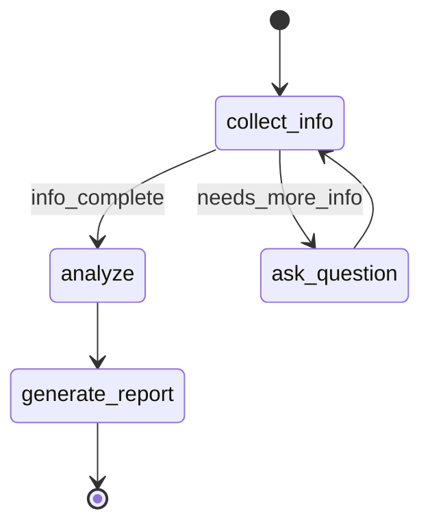
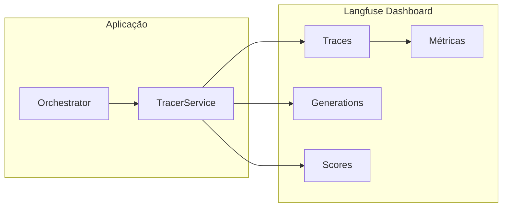
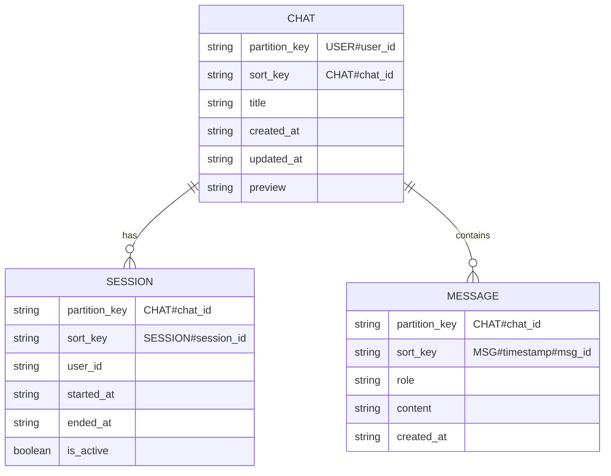

# Chatbot Template

Template base para construção de chatbots inteligentes com **LangGraph**, **AWS Bedrock**, **DynamoDB** e suporte a múltiplos canais de comunicação.

## Canais Suportados

| Canal | Endpoint | Uso |
|-------|----------|-----|
| **WebSocket** | `/ws/chat/completions` | Aplicações web/mobile em tempo real |
| **WhatsApp** | `/webhook/whatsapp` | Integração com Meta WhatsApp Business API |
| **REST API** | `/api/chats/*` | Gerenciamento de histórico e sessões |



## Arquitetura Completa



---

## WebSocket (Chat em Tempo Real)

O WebSocket é o canal principal para aplicações web e mobile que precisam de respostas em tempo real.

### Fluxo de Conexão



### Protocolo de Mensagens

#### Enviar Mensagem (Cliente → Servidor)

```json
{
  "user_id": "user_123",
  "question": "Olá, como você pode me ajudar?",
  "chat_id": "chat_abc",      // opcional - cria novo se não informado
  "session_id": "sess_xyz"    // opcional - cria nova se não informado
}
```

#### Eventos Recebidos (Servidor → Cliente)

| Evento | Descrição | Payload |
|--------|-----------|---------|
| `connected` | Conexão estabelecida | `{type, message}` |
| `start` | Processamento iniciado | `{type, session_id, chat_id, message_id}` |
| `agent_response` | Resposta do agente | `{type, message_id, content}` |
| `error` | Erro no processamento | `{type, message, message_id?}` |
| `end` | Processamento finalizado | `{type, message_id, session_id, chat_id, full_text}` |

### Exemplo: Cliente JavaScript

```javascript
class ChatbotClient {
  constructor(url) {
    this.url = url;
    this.ws = null;
    this.chatId = null;
    this.sessionId = null;
  }

  connect() {
    return new Promise((resolve, reject) => {
      this.ws = new WebSocket(this.url);

      this.ws.onopen = () => console.log('Conectado');

      this.ws.onmessage = (event) => {
        const data = JSON.parse(event.data);
        this.handleEvent(data);
      };

      this.ws.onerror = (error) => reject(error);

      this.ws.onclose = () => console.log('Desconectado');

      // Aguarda evento "connected"
      const checkConnected = setInterval(() => {
        if (this.ws.readyState === WebSocket.OPEN) {
          clearInterval(checkConnected);
          resolve();
        }
      }, 100);
    });
  }

  handleEvent(data) {
    switch (data.type) {
      case 'connected':
        console.log('Conexão confirmada:', data.message);
        break;

      case 'start':
        this.chatId = data.chat_id;
        this.sessionId = data.session_id;
        console.log('Processando...', data.message_id);
        break;

      case 'agent_response':
        console.log('Resposta:', data.content);
        // Atualiza UI com a resposta
        this.onResponse?.(data.content);
        break;

      case 'error':
        console.error('Erro:', data.message);
        this.onError?.(data.message);
        break;

      case 'end':
        console.log('Finalizado:', data.full_text);
        this.onComplete?.(data);
        break;
    }
  }

  send(userId, question) {
    const payload = {
      user_id: userId,
      question: question,
      chat_id: this.chatId,
      session_id: this.sessionId,
    };
    this.ws.send(JSON.stringify(payload));
  }

  disconnect() {
    this.ws?.close();
  }
}

// Uso
const client = new ChatbotClient('ws://localhost:8181/ws/chat/completions');

client.onResponse = (content) => {
  document.getElementById('response').innerText = content;
};

await client.connect();
client.send('user_123', 'Olá, como você pode me ajudar?');
```

### Exemplo: Cliente Python

```python
import asyncio
import json
import websockets

class ChatbotClient:
    def __init__(self, url: str):
        self.url = url
        self.ws = None
        self.chat_id = None
        self.session_id = None

    async def connect(self):
        self.ws = await websockets.connect(self.url)
        # Aguarda evento connected
        response = await self.ws.recv()
        data = json.loads(response)
        if data.get("type") == "connected":
            print(f"Conectado: {data.get('message')}")

    async def send(self, user_id: str, question: str) -> str:
        payload = {
            "user_id": user_id,
            "question": question,
            "chat_id": self.chat_id,
            "session_id": self.session_id,
        }
        await self.ws.send(json.dumps(payload))

        full_response = ""

        while True:
            response = await self.ws.recv()
            data = json.loads(response)

            if data["type"] == "start":
                self.chat_id = data.get("chat_id")
                self.session_id = data.get("session_id")
                print(f"Processando... (chat: {self.chat_id})")

            elif data["type"] == "agent_response":
                full_response = data.get("content", "")
                print(f"Resposta: {full_response[:100]}...")

            elif data["type"] == "error":
                raise Exception(data.get("message"))

            elif data["type"] == "end":
                print("Finalizado!")
                return full_response

    async def close(self):
        if self.ws:
            await self.ws.close()


# Uso
async def main():
    client = ChatbotClient("ws://localhost:8181/ws/chat/completions")

    try:
        await client.connect()

        # Primeira mensagem
        response = await client.send("user_123", "Olá!")
        print(f"Bot: {response}")

        # Continua a conversa
        response = await client.send("user_123", "Me conte mais sobre você")
        print(f"Bot: {response}")

    finally:
        await client.close()


asyncio.run(main())
```

---

## WhatsApp (Meta Cloud API)

Integração completa para receber e enviar mensagens via WhatsApp Business.

### Fluxo de Mensagens



### Configuração

1. **Crie um App no Meta Business Manager**
   - Acesse [developers.facebook.com](https://developers.facebook.com)
   - Crie um novo app do tipo "Business"
   - Adicione o produto "WhatsApp"

2. **Configure o Webhook**
   - URL: `https://seu-dominio/webhook/whatsapp`
   - Verify Token: mesmo valor do `WHATSAPP_VERIFY_TOKEN` no `.env`
   - Campos: `messages`

3. **Variáveis de Ambiente**

```env
WHATSAPP_PHONE_NUMBER_ID=123456789012345
WHATSAPP_ACCESS_TOKEN=EAAx...
WHATSAPP_VERIFY_TOKEN=seu_token_secreto
```

### Gerenciamento de Sessão

O `WhatsAppChatService` mantém sessões por número de telefone, garantindo que o chatbot "lembre" do contexto da conversa:

```
INÍCIO
   │
   ▼
┌─────────────────────────────────────────────────────────────────┐
│  PRIMEIRA MENSAGEM                                              │
│  Usuário manda "Olá" pelo WhatsApp pela primeira vez            │
│  → Sistema não conhece esse número ainda                        │
└─────────────────────────────────────────────────────────────────┘
   │
   ▼
┌─────────────────────────────────────────────────────────────────┐
│  NOVA SESSÃO                                                    │
│  → Cria user_id: "whatsapp_5511999999999"                       │
│  → Cria chat_id: "chat_abc123"                                  │
│  → Cria session_id: "sess_xyz789"                               │
│  → Guarda em memória associado ao número de telefone            │
└─────────────────────────────────────────────────────────────────┘
   │
   ▼
┌─────────────────────────────────────────────────────────────────┐
│  EM CONVERSA                                                    │
│  → Usuário continua mandando mensagens                          │
│  → Sistema usa os mesmos IDs (chat_id, session_id)              │
│  → Histórico da conversa é mantido                              │
│  → Pode voltar para cá várias vezes (loop)                      │
└─────────────────────────────────────────────────────────────────┘
   │
   ├──────────────────────┬───────────────────────┐
   ▼                      ▼                       │
┌──────────────┐   ┌──────────────┐               │
│  TIMEOUT     │   │  LIMPAR      │               │
│  Inatividade │   │  Usuário     │               │
│  > 24 horas  │   │  manda       │               │
│              │   │  "/reset"    │               │
└──────────────┘   └──────────────┘               │
   │                      │                       │
   ▼                      ▼                       │
  FIM              VOLTA PARA ───────────────────►┘
                   NOVA SESSÃO
```

**Na prática:**

| Situação | O que acontece |
|----------|----------------|
| **João manda "Oi"** | Sistema cria sessão para João (5511999...) |
| **João manda "Me ajuda"** | Sistema reconhece João, usa mesma sessão, mantém contexto |
| **João manda "Obrigado"** | Continua na mesma conversa |
| **João fica 2 dias sem falar** | Sessão pode expirar (timeout) |
| **João manda "/reset"** | Limpa sessão, próxima mensagem começa do zero |

**Código responsável** (`whatsapp_chat_service.py`):

```python
def _get_or_create_session(self, phone: str) -> Dict[str, Any]:
    if phone not in self._sessions:
        user_id = self._get_user_id_from_phone(phone)
        self._sessions[phone] = {
            "user_id": user_id,
            "chat_id": None,      # Preenchido na primeira mensagem
            "session_id": None,   # Preenchido na primeira mensagem
            "name": None,
        }
    return self._sessions[phone]
```

---

## Estrutura do Projeto

```
chatbot_template/
├── main.py                          # Entry point FastAPI
├── app/
│   ├── core/
│   │   ├── config.py                # Configurações (Settings)
│   │   └── service/
│   │       ├── chat/
│   │       │   └── chat_service.py  # Orquestrador principal
│   │       ├── llm/
│   │       │   ├── base_langchain_service.py
│   │       │   ├── bedrock_chat_service.py
│   │       │   └── graph/
│   │       │       ├── orchestrator_agent_service.py  # LangGraph
│   │       │       ├── prompts.py                     # System prompts
│   │       │       └── state.py                       # Estado do agente
│   │       └── whatsapp/
│   │           ├── whatsapp_service.py      # Meta API client
│   │           └── whatsapp_chat_service.py # Integração
│   └── dependency_injection/
│       ├── application_container.py  # Container principal
│       ├── gateways_container.py     # Clientes infra
│       ├── repositories_container.py # Repositórios
│       ├── services_container.py     # Serviços
│       └── whatsapp_container.py     # WhatsApp
├── domain/
│   ├── dto/
│   │   ├── chat.py                   # DTOs de chat
│   │   ├── responses.py              # DTOs de resposta
│   │   └── whatsapp.py               # DTOs WhatsApp
│   └── exceptions/
│       └── business_exception.py
├── infra/
│   ├── bedrock/
│   │   └── bedrock_client.py         # Cliente Bedrock
│   ├── dynamodb/
│   │   └── dynamodb_client.py        # Cliente DynamoDB
│   ├── repositories/
│   │   └── chat_repository.py        # Single Table Design
│   └── tracing/
│       └── tracing_client.py         # Langfuse
├── interface/
│   ├── api/
│   │   ├── chat_endpoints.py         # REST endpoints
│   │   ├── health_router.py          # Health check
│   │   └── webhook_whatsapp.py       # WhatsApp webhook
│   └── websocket/
│       └── chat_ws.py                # WebSocket endpoint
└── scripts/
    └── create_table.py               # Setup DynamoDB
```

---

## Quick Start

### 1. Configuração Inicial

```bash
# Clone o template
git clone <repo-url> meu-chatbot
cd meu-chatbot

# Copie o template de ambiente
cp .env-template .env

# Edite as variáveis (mínimo necessário)
nano .env
```

### 2. Configuração Mínima (.env)

```env
# AWS
AWS_REGION=us-east-1
BEDROCK_MODEL_ID_CHAT=us.anthropic.claude-3-7-sonnet-20250219-v1:0

# DynamoDB Local (desenvolvimento)
DDB_TABLE=MeuChatbotTable
USE_DYNAMODB_LOCAL=true
AWS_ENDPOINT_URL=http://localhost:8000
```

### 3. Executar

```bash
# Inicie o DynamoDB Local
docker-compose up -d

# Crie a tabela
python scripts/create_table.py

# Inicie a aplicação
python main.py
```

### 4. Testar

```bash
# Health check
curl http://localhost:8181/health

# WebSocket (use wscat)
npm install -g wscat
wscat -c ws://localhost:8181/ws/chat/completions

# Envie uma mensagem
> {"user_id": "user1", "question": "Olá!"}
```

---

## Customização

### Alterando o System Prompt

Edite `app/core/service/llm/graph/prompts.py`:

```python
SYSTEM_PROMPT = """Você é um assistente especializado em [SEU DOMÍNIO].

**Seu objetivo:**
- [Descreva o objetivo]

**Diretrizes:**
- [Liste as diretrizes]
"""
```

### Adicionando Novos Nós ao Grafo

O LangGraph permite criar fluxos complexos com múltiplos nós:



Edite `app/core/service/llm/graph/orchestrator_agent_service.py`:

```python
def _build_graph(self) -> Runnable:
    workflow = StateGraph(AgentState)

    # Adicione seus nós
    workflow.add_node("process_message", self._process_message_node)
    workflow.add_node("classify_intent", self._classify_intent_node)
    workflow.add_node("handle_faq", self._handle_faq_node)
    workflow.add_node("handle_sales", self._handle_sales_node)
    workflow.add_node("respond", self._respond_node)

    workflow.set_entry_point("process_message")

    # Configure as transições
    workflow.add_edge("process_message", "classify_intent")

    workflow.add_conditional_edges(
        "classify_intent",
        self._route_by_intent,
        {
            "faq": "handle_faq",
            "sales": "handle_sales",
            "other": "respond",
        },
    )

    workflow.add_edge("handle_faq", "respond")
    workflow.add_edge("handle_sales", "respond")
    workflow.add_edge("respond", END)

    return workflow.compile(checkpointer=MemorySaver())
```

### Adicionando Campos ao Estado

Edite `app/core/service/llm/graph/state.py`:

```python
class AgentState(TypedDict):
    # Campos base
    messages: Annotated[List[BaseMessage], add_messages]
    user_id: Optional[str]
    chat_id: Optional[str]
    session_id: Optional[str]

    # Seus campos customizados
    intent: Optional[str]
    entities: Optional[Dict[str, Any]]
    sentiment: Optional[str]
```

---

## Exemplos de Casos de Uso

### Chatbot de Atendimento ao Cliente



### Assistente de Vendas



### Bot de Diagnóstico



---

## Observabilidade (Langfuse)



**Configuração:**

```env
LANGFUSE_HOST=https://cloud.langfuse.com
LANGFUSE_PUBLIC_KEY=pk-xxx
LANGFUSE_SECRET_KEY=sk-xxx
```

---

## DynamoDB Schema (Single Table Design)



---

## Deploy

### Docker

```bash
# Build
docker build -t chatbot-template .

# Run
docker run -p 8181:8181 --env-file .env chatbot-template
```

### AWS (ECR + ECS/Lambda)

```bash
# Configure as variáveis
export AWS_ACCOUNT_ID=123456789012
export AWS_REGION=us-east-1
export ECR_REPO_NAME=chatbot-template

# Execute o script
./push_image_ecr.sh
```

---

## Endpoints

| Método | Endpoint | Descrição |
|--------|----------|-----------|
| GET | `/health` | Health check |
| WS | `/ws/chat/completions` | Chat em tempo real (WebSocket) |
| GET | `/api/chats/` | Listar chats do usuário |
| GET | `/api/chats/{id}/messages` | Histórico de mensagens |
| GET | `/api/chats/{id}/sessions` | Sessões do chat |
| PATCH | `/api/chats/{id}/title` | Atualizar título do chat |
| GET | `/webhook/whatsapp` | Verificação webhook (Meta) |
| POST | `/webhook/whatsapp` | Receber mensagens WhatsApp |

---

## Requisitos

- Python 3.11+
- AWS Account com acesso ao Bedrock
- Docker (para DynamoDB Local em desenvolvimento)

---

## Licença

MIT
